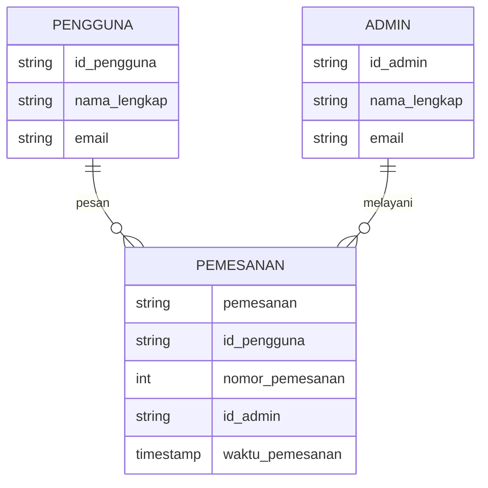
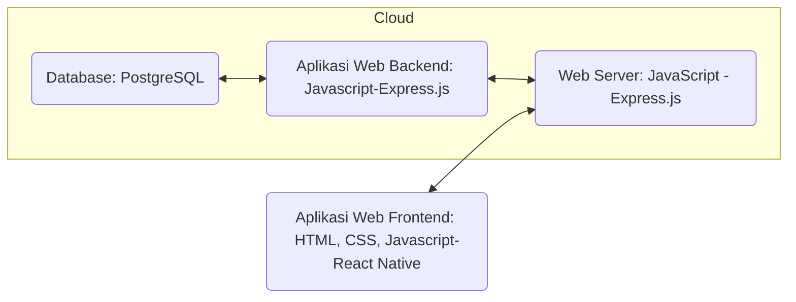

## 1.1 Latar Belakang

Di zaman yang serba digital ini, untuk bisa survive dalam hidup, kita harus selalu adaptif dan melek terhadap perkembangan teknologi yang ada. Sebagai contoh, dilansir dari republika.co.id, Ketua Umum Asosiasi UMKM Indonesia (Akumindo), M Ikhsan Ingratubun mengatakan bahwa pandemi telah membuat mayoritas UMKM bangkrut. Menurutnya, jumlah UMKM telah berkurang pada 2020 menjadi 34 juta unit dari 64,7 juta unit pada 2019. Salah satu yang membuat UMKM dapat bertahan adalah digitalisasi dengan berjualan secara online. Menurut Ikhsan, saat ini adalah kesempatan luar biasa untuk mulai pengembangan digitalisasi UMKM karena terbukti disambut sangat baik oleh konsumen. Dari data tersebut kita tahu bahwa bukan hal yang mustahil memperkenalkan bisnis kita kepada khalayak luas dalam waktu cepat di zaman sekarang, hanya dengan mempromosikan nya lewat media sosial, tentu sangat memungkinkan dunia mengetahui keberadaan bisnis kita.

Pada intinya alasan yang melatar belakangi saya membuat website ini adalah untuk membuat UMKM diluar sana terfasilitasi dalam segi promosi produknya, sehingga produk yang dijual dapat dikenal khalayak luas sehingga dapat turut bersaing dengan kompetitor yang juga bermain dalam dunia internet.

## 1.2. Deksripsi Teknologi Informasi

Website merupakan salah satu media internet yang dibuat atas dasar berbagai macam kebutuhan, entah itu untuk kepentingan profil perusahaan, transaksi jual beli, media belajar, dan masih banyak lagi. Website ini terbangun atas beberapa halaman situs yang saling terintegrasi dengan fungsinya yang berbeda-beda, dengan menggunakan website, kita dapat mempublikasikan berbagai informasi pada dunia.

Berdasarkan fungsinya, website terbagi menjadi banyak jenis, diantaranya web portofolio, web perusahaan, web instansi atau organisasi, web pendidikan, web e-commerce, web media massa dan lain sebagainya. Di zaman sekarang web bukan lagi hal yang asing, bahkan suatu riset di tahun 2021 dari situs Internet Live Stats mengatakan, ada lebih dari 1,89 miliar website di internet saat ini.

## 1.3. Branding

- Merk: Bakso Hegar
- Tagline: Anda kenyang, anda pun senang
- Campaign: Bagaimana bisa membuat website interaktif yang memungkinkan terjadinya transaksi jual beli produk
- Target User:
  - User di Daerah Bandung
    - Usia 12+
    - Seseorang yang membutuhkan makanan siap saji
    - Seseorang yang membutuhkan stok frozen food berupa bakso
    - Seseorang yang membutuhkan makanan tanpa harus membeli keluar
  - User di Daerah Luar Bandung
    - Usia 12+
    - Seseorang yang membutuhkan stok frozen food berupa bakso
- User experience theme:
  - Mudah
  - Sederhana
  - Menggugah selera makan
  - Warna: kuning lemon, putih, hijau daun, dan merah gelap
  - Insprirasi Desain:
    - Beranda page
      
    - Produk page
      
    - Tentang Kami page
      
    - Kontak Kami page
      

## 2. User Story

| Sebagai  | Saya ingin bisa                    | Sehingga                                                            | Prioritas  |
| -------- | ---------------------------------- | ------------------------------------------------------------------- | ---------- |
| Pengguna | Mendaftarkan diri sebagai pengguna | Saya merasa aman saat berselancar di website ini | ⭐⭐⭐⭐⭐  |
| Pengguna | Memesan produk                     | Produk dikirim pada saya                                            | ⭐⭐⭐⭐⭐ |
| Pengguna | Melihat deskripsi produk           | Saya tahu bagaimana produk yang akan saya beli                      | ⭐⭐⭐⭐⭐ |
| Pengguna | Melihat rating produk              | Saya tahu produk yang direkomendasikan user lain                    | ⭐⭐⭐⭐   |
| Pengguna | Memberi rating produk | Saya dapat merekomendasikan produk pada user lain | ⭐⭐⭐⭐   |
| Pengguna | Melihat stok tersedia | Saya dapan menyesuaikan jumlah pembelian | ⭐⭐⭐   |
| Pengguna | Melihat total produk terjual | Saya dapat menyimpulkan mana produk terlaris | ⭐⭐⭐   |
| Pengguna | Mengirim kritik dan saran          | Saya dapat membantu brand mengembangkan usahanya                    | ⭐⭐⭐⭐⭐ |
| Pengguna | Melihat seluruh media sosial brand | Saya dapat menghubungi penjual dan mendapat respon yang lebih cepat | ⭐⭐⭐⭐   |

## 3. Struktur Data

## 4. Arsitektur Sistem

## 5. Teknologi, Library, dan Framework

- HTML
- CSS
- Javascript
- React Native
- Express.js
- postgreSQL
- GIT sebagai version control system

## 6. Desain User Experience dan User Interface

## 7. Demonstrasi Video

[Link youtube nya](https://youtu.be/C3jp7qKwIys)

## 8. Bagaimana mesin komputasi dan sistem operasi berperan dalam produk teknologi informasimu ?

[Link youtube nya](https://youtu.be/C3jp7qKwIys)

## 9. Bagaimana algoritma, struktur data, dan bahasa pemrograman berperan dalam produk teknologi informasimu ?

[Link youtube nya](https://youtu.be/C3jp7qKwIys)

## 10. Bagaimana metode pengembangan perangkat lunak / Software Development Life Cycle berperan dalam produk teknologi informasimu ?

[Link youtube nya](https://youtu.be/C3jp7qKwIys)

## 11. Bagaimana database / sistem basis data berperan dalam produk teknologi informasimu ?

[Link youtube nya](https://youtu.be/C3jp7qKwIys)
