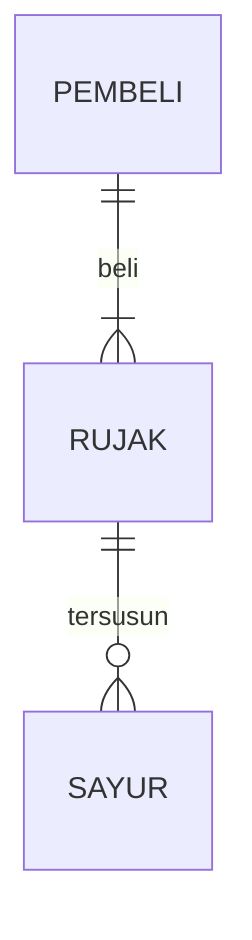

## 1.1 Latar Belakang

Di zaman yang serba digital ini, untuk bisa survive dalam hidup, kita harus selalu adaptif dan melek terhadap perkembangan teknologi yang ada. Sebagai contohnya tidak sedikit diluar sana orang yang gagal mengembangkan bisnisnya hanya karena kalah saing dengan kompetitor yang sudah melek terhadap teknologi yang dapat membantu bisnisnya menjadi dikenal banyak orang. Bukan hal yang mustahil memperkenalkan bisnis kita kepada khalayak luas dalam waktu cepat di zaman sekarang, tentu jawaban dari keresahan tersebut tidak lain adalah dengan mempromosikan nya lewat media sosial atau media internet lainnya yang memungkinkan dunia mengetahui keberadaan bisnis kita.

Pada intinya alasan yang melatar belakangi saya membuat website ini adalah untuk membuat UMKM diluar sana terfasilitasi dalam segi promosi produknya, sehingga produk yang dijual dapat dikenal khalayak luas karena turut bersaing dengan kompetitor yang juga bermain dalam media internet.

## 1.2. Deksripsi Teknologi Informasi

Website merupakan salah satu media internet yang dibuat atas dasar berbagai macam kebutuhan, entah itu untuk kepentingan profil perusahaan, transaksi jual beli, media belajar, dan masih banyak lagi. Website ini terbangun atas beberapa halaman situs yang saling terintegrasi dengan fungsinya yang berbeda-beda, dengan menggunakan website, kita dapat mempublikasikan berbagai informasi pada dunia.

## 1.3. Branding

- Merk: Bakso Hegar
- Tagline:
- Campaign: Bagaimana bisa membuat website interaktif yang memungkinkan terjadinya transaksi jual beli produk
- Target User:
  - User di Daerah Bandung
    - Usia 12+
    - Seseorang yang membutuhkan makanan siap saji
    - Seseorang yang membutuhkan stok frozen food berupa bakso
    - Seseorang yang membutuhkan makanan tanpa harus membeli keluar
  - User di Daerah Luar Bandung
    - Usia 12+
    - Seseorang yang membutuhkan stok frozen food berupa bakso
- User experience theme:
  - Mudah
  - Sederhana
  - Menggugah selera makan
  - Warna: kuning lemon, putih, hijau daun, dan merah gelap
  * Insprirasi Desain:

## 2. User Story

| Sebagai  | Saya ingin bisa                    | Sehingga                                                            | Prioritas  |
| -------- | ---------------------------------- | ------------------------------------------------------------------- | ---------- |
| Pengguna | Memesan produk                     | Produk dikirim pada saya                                            | ⭐⭐⭐⭐⭐ |
| Pengguna | Melihat deskripsi produk           | Saya tahu bagaimana produk yang akan saya beli                      | ⭐⭐⭐⭐⭐ |
| Pengguna | Melihat rating produk              | Saya tahu produk yang direkomendasikan user lain                    | ⭐⭐⭐⭐   |
| Pengguna | Melihat seluruh media sosial brand | Saya dapat menghubungi penjual dan mendapat respon yang lebih cepat | ⭐⭐⭐⭐   |
| Pengguna | Mengirim kritik dan saran          | Saya dapat membantu brand mengembangkan usahanya                    | ⭐⭐⭐⭐⭐ |

## 3. Struktur Data

Cara membuat aneka macam bentuk grafik menggunakan mermaid.js bisa lihat di [https://mermaid.js.org/syntax/entityRelationshipDiagram.html](https://mermaid.js.org/syntax/entityRelationshipDiagram.html)

## 4. Arsitektur Sistem

Masih pake mermaid.js juga bisa lihat flowchart di [https://mermaid.js.org/syntax/flowchart.html](https://mermaid.js.org/syntax/flowchart.html)

## 5. Teknologi, Library, dan Framework

bla bla bla

## 6. Desain User Experience dan User Interface

Bisa load image

## 7. Demonstrasi Video

Link youtube nya

## 8. Bagaimana mesin komputasi dan sistem operasi berperan dalam produk teknologi informasimu ?

Link youtube nya di detik jawaban ini

## 9. Bagaimana algoritma, struktur data, dan bahasa pemrograman berperan dalam produk teknologi informasimu ?

Link youtube nya di detik jawaban ini

## 10. Bagaimana metode pengembangan perangkat lunak / Software Development Life Cycle berperan dalam produk teknologi informasimu ?

Link youtube nya di detik jawaban ini

## 11. Bagaimana database / sistem basis data berperan dalam produk teknologi informasimu ?

Link youtube nya di detik jawaban ini
